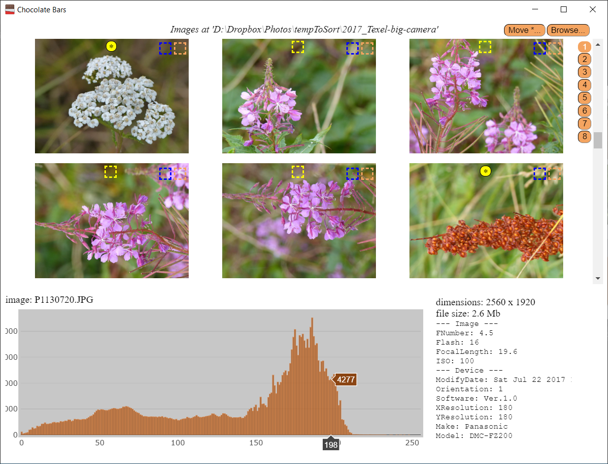

# :chocolate_bar: chocolate-bars readme

Present histograms (bars!) of images in a directory, including extras such as exif data from the camera. Star and move favorite images.

Electron based app - so, it runs on node.js.

## status - stable

chocolate-bars is stable on Windows (Linux, Mac possible but not tested). Releases follow semantic versioning.

[](https://travis-ci.org/mrseanryan/chocolate-bars)
[](https://nodejs.org)

[](https://greenkeeper.io/)
[](https://david-dm.org/mrseanryan/chocolate-bars)
[](https://david-dm.org/mrseanryan/chocolate-bars?type=dev)

[](https://www.npmjs.org/package/chocolate-bars)
[](https://npmjs.org/package/chocolate-bars)

[](https://github.com/prettier/prettier)
[](https://github.com/semantic-release/semantic-release)

[](https://opensource.org/licenses/MIT)
[](https://paypal.me/mrseanryan)

## why?

Histograms are useful for finding image defects such as:

-   over-exposure
-   under-exposure
-   low contrast

Also was curious how to implement this in node.js.

Also, I really miss the 'moved starred images' feature of [good ole' Picasa](http://googlephotos.blogspot.com/2016/02/moving-on-from-picasa.html)

## dependencies

-   Node 8.11.3 or higher

## features

-   scan a folder of images and present a browsable summary
-   show image thumbnails and histogram
-   show additional image properties such as file size, image size
-   show exif tags where available (JPEG files)
-   'star' images in a folder like in Picasa
-   move previously 'starred' images to a new folder

## usage - as cli (command line tool)

### 1. Install dependencies

Install:

-   Yarn
-   Node 8.3.11 (or higher)

### 2. Get chocolate bars (histograms) of images



#### ways to run

You can run `chocolate-bars` in one of two ways:

-   a) as a globally installed command line tool
-   OR b) from the source code

##### a) install globally as a command line tool

`npm i -g electron@4`

`npm i -g chocolate-bars@latest --production`

To use:

`chocolate-bars <path to image direcory>`

##### b) from the source code

```
yarn
```

_On Windows: use a bash shell like `git bash`._

To test your installation:

```
./test.sh
```

To check your images:

```
./go.sh <path to image direcory>
```

example:

```
./go.sh ../myPhotos
```

To see more detailed usage info:

```
./go.sh
```

### keyboard shortcuts

A number of keyboard shortcuts are available:

| Area                             | Key                  | Action                                 |
| -------------------------------- | -------------------- | -------------------------------------- |
| Images panel\*                   | Up Arrow, Down Arrow | Scroll up or down the set of images.   |
| Images panel\*                   | Space                | Scroll down the set of images.         |
| Selected image, Expanded image\* | +                    | Toggle the expanded view of the image. |
| Expanded image\*                 | \* or Enter          | Toggle the star for that image.        |
| Expanded image\*                 | Left Arrow           | Show the previous image.               |
| Expanded image\*                 | Right Arrow          | Show the next image.                   |
| Expanded image\*                 | Escape               | Close the expanded image.              |

\* An image is expanded by clicking on the small orange box in the top-right

## references

### electron starter

https://github.com/electron/electron-quick-start

### electron and react boilerplate

https://github.com/iRath96/electron-react-typescript-boilerplate

https://github.com/electron-react-boilerplate/electron-react-boilerplate

## sites

| site                 | URL                                          |
| -------------------- | -------------------------------------------- |
| source code (github) | https://github.com/mrseanryan/chocolate-bars |
| github page          | https://mrseanryan.github.io/chocolate-bars/ |
| npm                  | https://www.npmjs.com/package/chocolate-bars |

## developing code in _this_ repository

see the [contributing readme](CONTRIBUTING.md).

## origin

This project is based on the excellent seeder project [typescript-library-starter](https://github.com/alexjoverm/typescript-library-starter).

### ORIGINAL readme (from the seeder project)

[see here](README.original.md)

## authors

Original work by Sean Ryan - mr.sean.ryan(at gmail.com)

## licence = MIT

This project is licensed under the MIT License - see the [LICENSE](LICENSE) file for details
